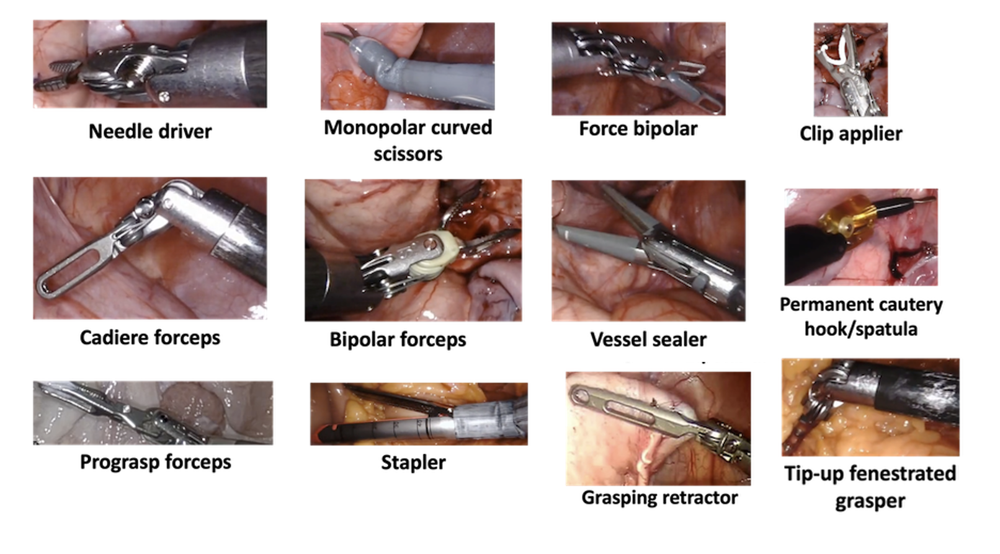

# Surgical Visual Understanding (SurgVU) Dataset


## Overview

With recent improvements in machine learning and the ability to collect large amounts of data during surgeries with robotic assistance, the field of surgical data science is ready for important foundational research. This collection serves as a resource for a large dataset of surgical videos and their corresponding labels, organized for research purposes in the area of surgical data science.

## Description

Robotic-assisted surgery (RAS) is increasingly popular, with over a million procedures performed annually, generating substantial data ripe for machine learning applications. The Surgical Visual Understanding (SurgVU) dataset offers a vast collection of surgical videos and labels, captured during training sessions hosted by Intuitive Surgical, Inc. Surgeons perform standard tasks on a porcine model, producing over 840 hours of video at 60 frames per second, resulting in approximately 18 million labeled images.

This dataset supports annual machine learning challenges, such as the Endoscopic Vision (EndoVis) challenge at the MICCAI conference, focusing on issues like tool detection and step recognition. Beyond these challenges, the dataset is valuable for broader applications, including video segmentation and generative algorithms.

The SurgVU dataset lowers barriers for new ML enthusiasts, serving as a benchmark for algorithm development and accelerating research across diverse disciplines. As the largest publicly available surgical video dataset, it provides a vital resource for the field of surgical data science. Future expansions, potentially including more videos or additional labels, are anticipated, fostering community-driven growth and innovation.

## Dataset Overview & Composition

This dataset, built from standardized surgical training tasks using the da Vinci robotic system, features video and system data from operations on porcine tissues. It includes:

### Tools

Up to three robotic tools appear in each clip, with twelve types featured, such as needle drivers and forceps. Tool presence labels, stored in `tools.csv`, may be noisy due to visibility issues.



### Tasks

Eight surgical tasks, including suturing and artery manipulation, are annotated by clinical experts. Task details are in `tasks.csv`.


### Summary

The dataset contains 280 video clips from 155 sessions, totaling 840 hours of footage at 60 frames per second, yielding around 18 million frames at 720p resolution. 


## Dataset Access

The dataset is divided into several components, each accessible via the following URLs:

- **Surgical Videos**: [Access Videos](https://storage.googleapis.com/isi-surgvu/surgvu24_videos_only.zip)
- **Labels**: [Access Labels](https://storage.googleapis.com/isi-surgvu/surgvu24_labels_updated_v2.zip)
- **Validation Set for Tool Detection**: [Access Validation Set](https://storage.googleapis.com/isi-surgvu/cat1_test_set_public.zip)


## Usage

This repository is intended to be a reference to the published paper and dataset. Researchers are encouraged to explore the dataset for their specific machine learning challenges and contribute to the growing body of work in surgical data science.

## Citation

If you use this dataset in your research, please cite the accompanying paper:

```bibtex
@misc{zia2025surgicalvisualunderstandingsurgvu,
      title={Surgical Visual Understanding (SurgVU) Dataset},
      author={Aneeq Zia and Max Berniker and Rogerio Nespolo and Conor Perreault and Ziheng Wang and Benjamin Mueller and Ryan Schmidt and Kiran Bhattacharyya and Xi Liu and Anthony Jarc},
      year={2025},
      eprint={2501.09209},
      archivePrefix={arXiv},
      primaryClass={cs.CV},
      url={https://arxiv.org/abs/2501.09209},
}
